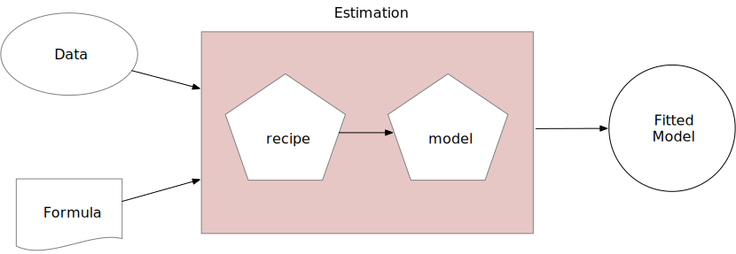

class: title-slide, left, middle
background-image: url("images/recipes.svg")
background-position: 85% 50%
background-size: 30%
background-color: #F9F8F3

.pull-left[

# `r rmarkdown::metadata$title`

### `r rmarkdown::metadata$author`

### `r rmarkdown::metadata$slides`

]

---
layout: false
class: inverse, middle, center

# [`tidymodels.org`](https://www.tidymodels.org/)

# _Tidy Modeling with R_ ([`tmwr.org`](https://www.tmwr.org/))

```{r startup, include = FALSE}
library(tidymodels)
tidymodels_prefer()
thm <- theme_bw() + 
  theme(
    panel.background = element_rect(fill = "transparent", colour = NA), 
    plot.background = element_rect(fill = "transparent", colour = NA),
    legend.position = "top",
    legend.background = element_rect(fill = "transparent", colour = NA),
    legend.key = element_rect(fill = "transparent", colour = NA)
  )
theme_set(thm)
source("_common.R")
options(width = 100)
```

---
layout: false
class: inverse, middle, center

# [`tidymodels.org`](https://www.tidymodels.org/)

# _Tidy Modeling with R_ ([`tmwr.org`](https://www.tmwr.org/))


---
# Before we get started, some example data

We'll use the Chicago "L" train data today, described in our [_Feature Engineering and Selection_](https://bookdown.org/max/FES/chicago-intro.html) book. 

Several years worth of pre-pandemic data were assembled to try to predict the daily number of people entering the Clark and Lake elevated ("L") train station in Chicago. 

For predictors, 

* the 14-day lagged ridership at this and other stations (units: thousands of rides/day) `r emo::ji("star")`
* weather data
* home/away game schedules for Chicago teams
* the date `r emo::ji("star")``r emo::ji("star")``r emo::ji("star")`

The data are in the `modeldata` package. See `?Chicago`. 


---
# Loading and splitting the Chicago data

```{r previously}
library(tidymodels)
tidymodels_prefer()
data("Chicago")

# Save last 14 days as a test set:
chi_split <- initial_time_split(Chicago, prop = 1 - (14/nrow(Chicago)))

chi_train <- training(chi_split)
chi_test  <- testing(chi_split)
```

.pull-left[
```{r hist-code, eval = FALSE}
ggplot(chi_train, aes(ridership)) + 
  geom_histogram(bins = 40, col = "white")
```
]
.pull-right[
```{r hist, ref.label="hist-code", echo = FALSE, out.height = '50%', out.width= '90%', fig.width=6, fig.height=4,fig.align='center', dev = 'svg', dev.args = list(bg = "transparent")}
ggplot(chi_train, aes(ridership)) + 
  geom_histogram(bins = 40, col = "white")
```
]


---
# What is feature engineering?

First thing's first: what's a feature? 

I tend to think of a feature as some representation of a predictor that will be used in a model. 

Old-school features: 

 * Interactions
 * Polynomial expansions/splines
 * PCA feature extraction
 
"Feature engineering" sounds pretty cool, but let's take a minute to talk about _preprocessing_ data.  

---
# Two types of preprocessing

```{r venn-titles, echo = FALSE, out.width="75%", fig.align='center'}
knitr::include_graphics("images/fe_venn.svg")
```

---
# Two types of preprocessing

```{r venn-info, echo = FALSE, out.width="75%", fig.align='center'}
knitr::include_graphics("images/fe_venn_info.svg")
```


---
# Easy examples

For example, centering and scaling are definitely not feature engineering.

Consider the `date` field in the Chicago data. If given as a raw predictor, it is converted to an integer. 

Spoiler alert: the date is the most important factor. It can be re-encoded as:

* Days since a reference date `r emo::ji("sleepy")`
* Day of the week `r paste0(rep(emo::ji("heart"), 4), collapse = "")`
* Month `r emo::ji("sleepy")`
* Year `r paste0(rep(emo::ji("heart"), 2), collapse = "")`
* Indicators for holidays `r paste0(rep(emo::ji("heart"), 3), collapse = "")`
* Indicators for home games for NFL, NBA, etc.  `r emo::ji("sleepy")`


---
# Original column

```{r before-fe, echo = FALSE, out.width="35%", fig.align='center'}
knitr::include_graphics("images/steve.gif")
```


---
# Features

```{r after-fe, echo = FALSE, out.width="75%", fig.align='center'}
knitr::include_graphics("images/cap.png")
```


(At least that's what we hope the difference looks like.)


---
# Or, in case you are anime/manga fans

.pull-left[

Original Column:

```{r saitama-orig, echo = FALSE, out.width="75%", fig.align='center'}

```
]
.pull-right[

Feature: 

<br>

```{r saitama-feat, echo = FALSE, out.width="75%", fig.align='center'}

```
]


---
# General definitions

* _Data preprocessing_ are the steps that you take to make your model successful. 

* _Feature engineering_ are what you do to the original predictors to make the model do the least work to predict the outcome as well as possible. 

We'll demonstrate the `r pkg(recipes)` package for all of your data needs. 

---
# Recipes prepare your data for modeling

The package is extensible framework for pipeable sequences of feature engineering steps provides preprocessing tools to be applied to data. 
    
Statistical parameters for the steps can be estimated from an initial data set and then applied to other data sets. 
    
The resulting processed output can then be used as inputs for statistical or machine learning models.


---
# A first recipe

```{r}
chi_rec <- 
  recipe(ridership ~ ., data = chi_train)

# If ncol(data) is large, you can use
# recipe(data = chi_train)
```

Based on the formula, the function assigns columns to roles of "outcome" or "predictor"

```{r}
summary(chi_rec)
```


---
# A first recipe - work with dates

```{r}
chi_rec <- 
  recipe(ridership ~ ., data = chi_train) %>% 
  step_date(date, features = c("dow", "month", "year")) #<<
```

This creates three new columns in the data based on the date. Now that the day-of-the-week column is a factor.

---
# A first recipe - work with dates

```{r}
chi_rec <- 
  recipe(ridership ~ ., data = chi_train) %>% 
  step_date(date, features = c("dow", "month", "year")) %>% 
  step_holiday(date) #<<
```

Add indicators for major holidays. Specific holidays, especially those ex-US, can also be generated. 

At this point, we don't need `date` anymore. Instead of deleting it (there is a step for that) we will change its _role_ to be an identification variable. 

---
# A first recipe - work with dates

```{r, highlight.col = "#ADD8E6"}
chi_rec <- 
  recipe(ridership ~ ., data = chi_train) %>% 
  step_date(date, features = c("dow", "month", "year")) %>% 
  step_holiday(date) %>% 
  update_role(date, new_role = "id")#<<
```

`date` is still in the data set but tidymodels knows not to treat it as an analysis column. 

---
# A first recipe -create indicator variables

```{r}
chi_rec <- 
  recipe(ridership ~ ., data = chi_train) %>% 
  step_date(date, features = c("dow", "month", "year")) %>% 
  step_holiday(date) %>% 
  update_role(date, new_role = "id") %>% 
  step_dummy(all_nominal_predictors()) #<<
```

For any factor or character predictors, make binary indicators. 

There are _many_ recipe steps that can convert categorical predictors to numeric columns. 


---
# A first recipe - filter out constant columns

```{r}
chi_rec <- 
  recipe(ridership ~ ., data = chi_train) %>% 
  step_date(date, features = c("dow", "month", "year")) %>% 
  step_holiday(date) %>% 
  update_role(date, new_role = "id") %>% 
  step_dummy(all_nominal_predictors()) %>% 
  step_zv(all_predictors()) #<<
```

In case there is a holiday that never was observed, we can delete any _zero-variance_ predictors that have a single unique value.

Note that the selector chooses all columns with a role of "predictor"


---
# A first recipe - normalization

```{r}
chi_rec <- 
  recipe(ridership ~ ., data = chi_train) %>% 
  step_date(date, features = c("dow", "month", "year")) %>% 
  step_holiday(date) %>% 
  update_role(date, new_role = "id") %>% 
  step_dummy(all_nominal_predictors()) %>% 
  step_zv(all_predictors()) %>% 
  step_normalize(all_numeric_predictors()) #<<
```

This centers and scales the numeric predictors. 

Note that this will use the training set to estimate the means and standard deviations of the data. 

All data put through the recipe will be normalized using those statistics (there is no re-estimation). 


---
# A first recipe - reduce correlation

```{r}
chi_rec <- 
  recipe(ridership ~ ., data = chi_train) %>% 
  step_date(date, features = c("dow", "month", "year")) %>% 
  step_holiday(date) %>% 
  update_role(date, new_role = "id") %>% 
  step_dummy(all_nominal_predictors()) %>% 
  step_zv(all_predictors()) %>% 
  step_normalize(all_numeric_predictors()) %>% 
  step_corr(all_numeric_predictors(), threshold = 0.85) #<<
```

To deal with highly correlated predictors, find the minimum predictor set to remove to make the pairwise correlations are less than 0.85. This can be optimized by using a value of `tune()`. 


---
# Other possible steps

```{r}
chi_rec <- 
  recipe(ridership ~ ., data = chi_train) %>% 
  step_date(date, features = c("dow", "month", "year")) %>% 
  step_holiday(date) %>% 
  update_role(date, new_role = "id") %>% 
  step_dummy(all_nominal_predictors()) %>% 
  step_zv(all_predictors()) %>% 
  step_normalize(all_numeric_predictors()) %>% 
  step_pca(all_of(stations)) #<<
```

PCA feature extraction on the columns named in the character vector `stations`. 


(We'll use this version of the recipe in a minute)

---
# Other possible steps

```{r, eval = FALSE}
chi_rec <- 
  recipe(ridership ~ ., data = chi_train) %>% 
  step_date(date, features = c("dow", "month", "year")) %>% 
  step_holiday(date) %>% 
  update_role(date, new_role = "id") %>% 
  step_dummy(all_nominal_predictors()) %>% 
  step_zv(all_predictors()) %>% 
  step_normalize(all_numeric_predictors()) %>% 
  step_umap(all_numeric_predictors(), outcome = ridership) #<<
```

A fancy machine learning supervised dimension reduction technique


---
# Other possible steps

```{r, eval = FALSE}
chi_rec <- 
  recipe(ridership ~ ., data = chi_train) %>% 
  step_date(date, features = c("dow", "month", "year")) %>% 
  step_holiday(date) %>% 
  update_role(date, new_role = "id") %>% 
  step_dummy(all_nominal_predictors()) %>% 
  step_zv(all_predictors()) %>% 
  step_normalize(all_numeric_predictors()) %>% 
  step_ns(Clark_Lake, deg_free = 10)#<<
```

Nonlinear transforms like _natural splines_ and so on. 


---
# Recipes are estimated

_Every_ preprocessing step in a recipe that involved calculations uses the _training set_. For example: 

 * Levels of a factor
 * Determination of zero-variance
 * Normalization
 * Feature extraction
 
and so on. 

Once a a recipe is added to a workflow, this occurs when `fit()` is called. 


---
# Recipes follow this strategy

```{r real-model, echo = FALSE, out.width="70%", fig.align='center'}

```

This also means that when resampling is used, the recipe is repeatedly estimated (along with the model) on slightly different versions of the training set. 

This enables more realistic performance measures. 

**Workflow** objects are a great way to bind a model and preprocessor (e.g. recipe, formula, etc.).

---
# Adding recipes to workflows

Let's stick to a linear model for now and add the PCA recipe (instead of a formula):

.code70[

```{r}
lm_spec <- linear_reg() 

chi_wflow <- 
  workflow() %>% 
  add_model(lm_spec) %>% 
  add_recipe(chi_rec)

chi_wflow
```

]

---
# Estimate via `fit()`

Fitting encompasses estimating the recipe and the model. 


```{r}
chi_fit <- 
  chi_wflow %>% 
  fit(chi_train)

chi_fit %>% 
  tidy() %>% 
  slice_tail(n = 6)
```


---
# Prediction

When `predict()` is called, the fitted recipe is applied to the new data before it is predicted by the model:

```{r, warning = FALSE}
predict(chi_fit, chi_test)
```

You don't need to do anything else


---
# Debugging a recipe

90% of the time, you will want to use a workflow to estimate and apply a recipe. 

If you have an error, the original recipe object (e.g. `chi_rec`) can be estimated manually with a function called `bake()` (analogous to `fit()`). 

This returns the fitted recipe. This can help debug any issues. 

Another function (`bake()`) is analogous to `predict()` and gives you the processed data back. 

The [tidymodels book](https://www.tmwr.org/dimensionality.html#recipe-functions) has more details on debugging. 


---
# Fun facts about recipes

* Once `fit()` is called on a workflow, changing the model does not re-fit the recipe. 
* A list of all known steps is [here](https://www.tidymodels.org/find/recipes/). 
* Some steps can be [skipped](https://recipes.tidymodels.org/articles/Skipping.html) when using `predict()`. 
* The [order](https://recipes.tidymodels.org/articles/Ordering.html) of the steps matters. 
* There are `r pkg(recipes)`-adjacent packages with more steps: `r pkg(embed)`, `r pkg(timetk)`, `r pkg(textrecipes)`, and others. 
* There are a lot of ways to handle [categorical predictors](https://recipes.tidymodels.org/articles/Dummies.html) even those with novel levels. 
* Several `r pkg(dplyr)` steps exist, such as `step_mutate()`. 

---
# A natural language processing example

Julia and Emil have written an amazing text processing book: [_Supervised Machine Learning for Text Analysis in R_](https://smltar.com/) (SMLTAR) and we can use  `r pkg(textrecipes)` for processing the raw text data. 

We'll use some example data on amazon reviews to demonstrate

```{r}
library(textrecipes)

data(small_fine_foods)
# outcomes:
str(training_data$score)
# example review:
strwrap(training_data$review[[10]], width = 80)
```

---
# Split the text into tokens

```{r, results = "hide"}
recipe(score ~ review, data = training_data) %>% 
  step_tokenize(review)  #<<
```

By default, it splits by spaces so that tokens = words. 

There are many steps that do not require tokenization so this is optional. 

---
# Remove stop words? 

```{r, results = "hide"}
recipe(score ~ review, data = training_data) %>% 
  step_tokenize(review)  %>% 
  step_stopwords(review) #<<
```

These are words like "a", "the", etc. 

An option but it [may or may not help](https://smltar.com/stopwords.html). 

---
# Stem tokens?

```{r, results = "hide"}
recipe(score ~ review, data = training_data) %>% 
  step_tokenize(review) %>% 
  step_stem(review) #<<
```

Stemming reduces words to a common core. For example, removing "ing$", "ed$", "s$", "ly$" and so on. 

Also [optional](https://smltar.com/stemming.html). 


---
# Filter tokens by frequency

```{r, results = "hide"}
recipe(score ~ review, data = training_data) %>% 
  step_tokenize(review) %>% 
  step_tokenfilter(review, min_times = tune(), max_tokens = tune()) #<<
```

You can tune/optimize the number of tokens to retain using the value of `tune()` or assign a specific value. 


---
# Convert to numeric features (pt 1)

```{r, results = "hide"}
recipe(score ~ review, data = training_data) %>% 
  step_tokenize(review) %>% 
  step_tokenfilter(review, min_times = tune(), max_tokens = tune()) %>% 
  step_tfidf(review) #<<
```

Term frequency–inverse document frequency encodings weight each token frequency by the inverse document frequency to produce a numeric feature. 


---
# Convert to numeric features (pt 2)

```{r, results = "hide"}
recipe(score ~ review, data = training_data) %>% 
  step_tokenize(review) %>% 
  step_tokenfilter(review, min_times = tune(), max_tokens = tune()) %>% 
  step_texthash(review, num_terms = tune()) #<<
```

[Feature hashing](https://smltar.com/mlregression.html#case-study-feature-hashing) produces values that are similar to dummy/indicator variables (per token) but does not generate all possible values. 

There is a lot more that can be done with text and I highly recommend taking a look at [SMLTAR](https://smltar.com/).


---

# Thanks

Thanks for the invitation to speak today!

The tidymodels team: Davis Vaughan, Julia Silge, and Hanna Frick. 

Special thanks for the other folks who contributed so much to tidymodels: Edgar Ruiz, Emil Hvitfeldt, Alison Hill, Desirée De Leon, and the tidyverse team.

These slides were made with the [`xaringan`](https://bookdown.org/yihui/rmarkdown/xaringan.html) package and styled by Alison Hill. 
